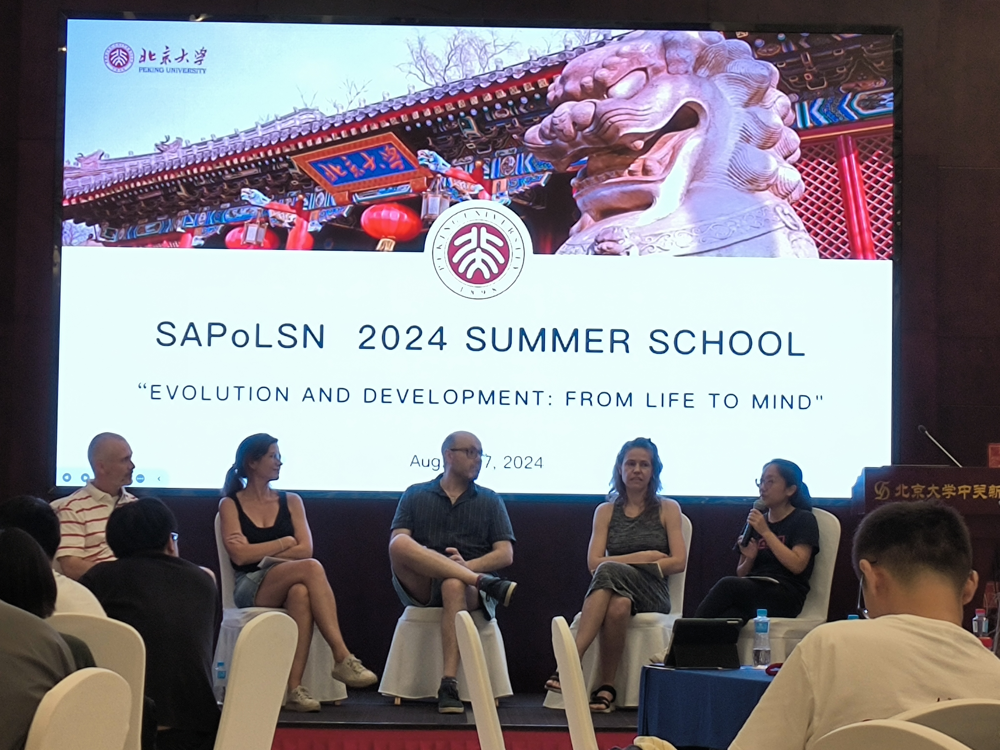
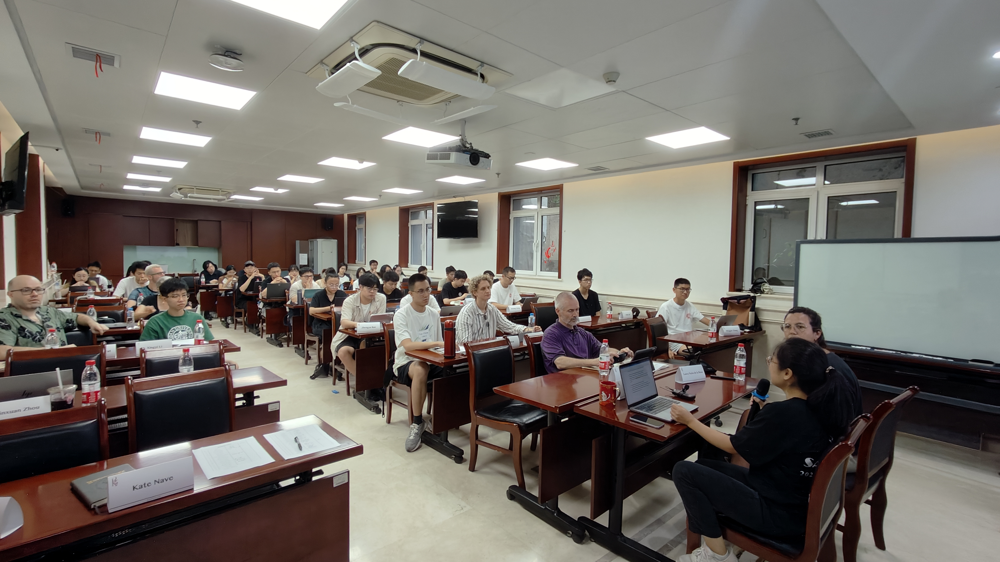

The first summer school will be hosted by the Department of Philosophy at Peking University in Beijing. Research at the intersection of evolution and development on features of living systems (e.g., anatomy, behavior, cognition) prompts a variety of philosophy of science questions: Why do scientists conceptualize phenomena similarly or differently? What types of methods are most suited to their investigation? How are different types of explanations evaluated? What counts as a scientific theory in this domain? The juncture of evolution and development has been particularly fruitful in fostering interdisciplinary investigations that involve philosophers and different kinds of scientists (e.g., population biologists, developmental biologists, paleontologists, systematists). These studies have advanced scientific understanding by shedding light on macroevolutionary transitions in animal morphology, the advent of evolutionary novelties, and the generation of organismal diversity, as well as suggested the need to rethink different aspects of scientific epistemology. Research on cognition has likewise used evolutionary and developmental considerations to understand major transitions in cognitive evolution, the origin of moral cognition, and human cognitive diversity. The summer school will engage with philosophical questions emerging around these and other contemporary issues at the nexus of evolution and development, including where biology and cognitive science contribute to each other.

In addition to traditional lectures, this summer school will involve diverse activity formats, including but not limited to interviews with invited scholars, academic development panels, brainstorming sessions (e.g., for identifying PhD thesis topics), group presentations, organized dinners, and (fun!) excursions. Students will have the opportunity to interact with and learn from world-famous philosophers in person, as well as to communicate and cooperate with their peers in depth.

**Main Instructors**
- Alan Love (University of Minnesota)
- Ingo Brigandt (University of Alberta)

