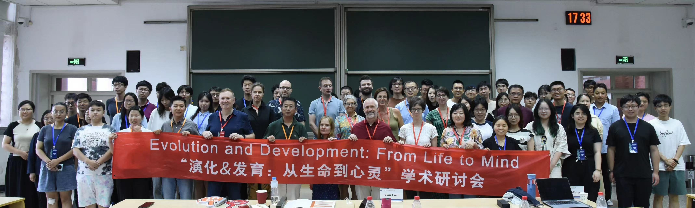
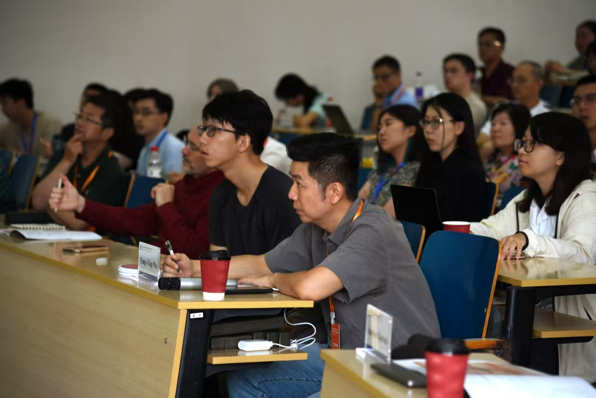
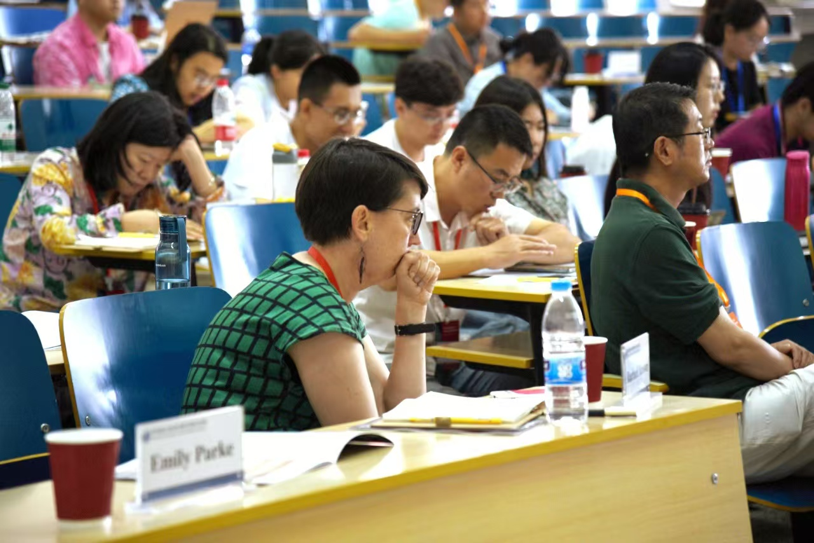

The study of the evolution of development (“evo-devo”) has been fruitful for scientific and philosophical investigations alike. With an interdisciplinary scope spanning genetics, genomics, embryology, paleontology, among other diverse fields, it has stressed the complexity of the close relationship between developmental and evolutionary processes for diverse traits, from morphology and behavior to cognition. The intermingling of questions about development and evolution, as well as the domain-spanning nature of evo-devo, prompts a variety of conceptual questions.

