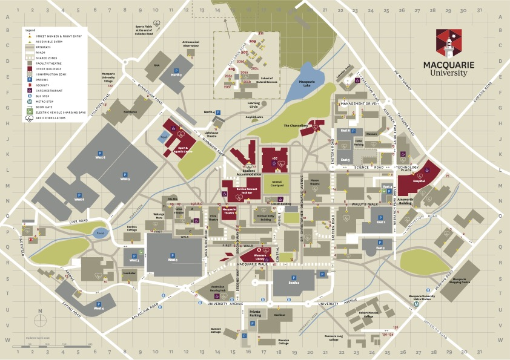

---
title: "2026 Workshop"
date: 2026-08-04
type: landing

design:
  spacing: "6rem"

sections:

  - block: hero
    content:
      title: |
        Philosophy Meets the Life Sciences

      text: |

        **24–25 August 2026**

        School of Humanities, Macquarie University, Sydney

        Registration information coming soon.

      image:
        filename: workshop-poster.jpg

  - block: markdown
    id: about

    content:
      title: About
      text: |

        The main objective of this 2-day workshop will be to showcase research in philosophy that deeply engages with the life sciences and, conversely, to feature work in the life sciences that engages substantially with philosophy. The theme of the workshop is intentionally broad, as an effort to support both continued dialogue between experts in philosophy and the life sciences while also providing a platform for potential future collaborations.

  - block: people
    id: speakers

    content:
      title: Speakers

      user_groups:
        - Speakers2026

      sort_by: Params.last_name
      sort_ascending: true

    design:
      show_role: true
      show_social: false
      show_interests: false

  - block: people
    id: organisers

    content:
      title: Organisers

      user_groups:
        - Organisers2026

      sort_by: Params.last_name
      sort_ascending: true

    design:
      show_role: true
      show_social: false
      show_interests: false

  - block: markdown
    id: program

    content:
      title: Program

      text: |

        ### Day 1 (24 August)

        Program information coming soon.

        ---

        ### Day 2 (25 August)

        Program information coming soon.

  - block: markdown
    id: location

    content:
      title: Location

      text: |

        

          
        

        School of Humanities

        Macquarie University

        Sydney, Australia
    
    design:
      css_class: "text-center"

  - block: markdown
    id: sponsors

    content:
      title: Sponsors
      text: |
        

        

          

            www.pku.edu.cn/" target="_blank">

              /images/institutions/pku.jpg

            </a>

            

              https://www.pku.edu.cn/" target="_blank">
                Peking University
              </a>
            

          

          

            /images/institutions/pku.jpg
            

              Peking University
            

          

          

            fdu_logo.png
            

              Fudan University
            

          

        

---