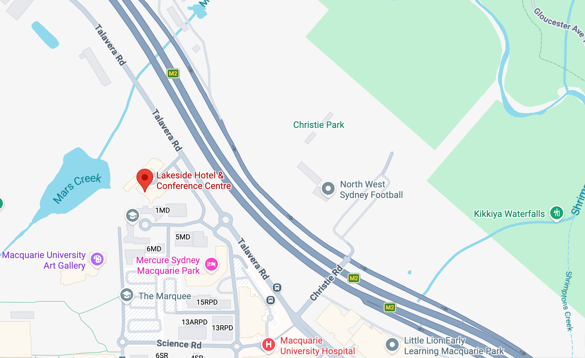

---
title: "2026 Workshop"

event: 2026 Workshop

location: School of Humanities, Macquarie University, Sydney

summary: Philosophy Meets the Life Sciences

date: 2026-08-24
date_end: 2026-08-25

all_day: false

publishDate: 2026-01-01T00:00:00Z

type: landing

design:
  spacing: "6rem"

sections:

  - block: hero
    content:
      title: |
        Philosophy Meets the Life Sciences

      text: |

        **24–25 August 2026**

        School of Humanities, Macquarie University, Sydney

      image:
        filename: 2026workshop.jpg

  - block: markdown
    id: about

    content:
      title: About
      text: |

        The main objective of this 2-day workshop will be to showcase research in philosophy that deeply engages with the life sciences and, conversely, to feature work in the life sciences that engages substantially with philosophy. The theme of the workshop is intentionally broad, as an effort to support both continued dialogue between experts in philosophy and the life sciences while also providing a platform for potential future collaborations.

  - block: people
    id: speakers

    content:
      title: Speakers

      user_groups:
        - Speakers2026

      sort_by: Params.last_name
      sort_ascending: true

    design:
      show_role: true
      show_social: false
      show_interests: false

  - block: people
    id: organisers

    content:
      title: Organisers

      user_groups:
        - Organisers2026

      sort_by: Params.last_name
      sort_ascending: true

    design:
      show_role: true
      show_social: false
      show_interests: false

  - block: markdown
    id: program

    content:
      title: Program

      text: |

        

        

          <a href="/uploads/2026workshop.pdf"
            target="_blank"
            rel="noopener">
            📄 Download Program (PDF)
          </a>
        

        <h2 style="text-align:center; margin-bottom:0.5rem;">
        Day 1 (24 August)
        </h2>

        

        strong>Venue:</strong> Room 121, 1 Management Drive
        

        <table class="schedule-table">

        <tr>
        <th class="schedule-time">Time</th>
        <th class="schedule-speaker">Speaker</th>
        <th class="schedule-title">Title</th>
        </tr>

        <tr>
        <td>8:30-8:50</td>
        <td colspan="2" class="schedule-break">Coffee / Registration</td>
        </tr>

        <tr>
        <td>8:50-9:00</td>
        <td colspan="2" class="schedule-break">Welcome</td>
        </tr>

        <tr>
        <td>Morning</td>
        <td colspan="2" class="schedule-break">Chair: Pierrick Bourrat</td>
        </tr>

        <tr>
        <td>9:00-9:45</td>
        <td>Rob Wilson (University of Western Australia)</td>
        <td>The Progenerative View of Kinship as a Philosophical Intervention in the Fragile Sciences</td>
        </tr>

        <tr>
        <td>9:45-10:30</td>
        <td>Mingjun Zhang (Fudan University)</td>
        <td>Demystifying Distinctively Mathematical Explanations</td>
        </tr>

        <tr>
        <td>10:30-11:00</td>
        <td colspan="2" class="schedule-break">Coffee Break 1</td>
        </tr>

        <tr>
        <td>11:00-11:45</td>
        <td>David Kaplan (Macquarie University)</td>
        <td>It's about time: A mechanistic perspective on timescales and temporal organisation in the brain</td>
        </tr>

        <tr>
        <td>11:45-12:30</td>
        <td>Andreas Wagner (University of Zürich)</td>
        <td>TBA</td>
        </tr>

        <tr>
        <td>12:30-2:00</td>
        <td colspan="2" class="schedule-break">Lunch</td>
        </tr>

        <tr>
        <td>Afternoon</td>
        <td colspan="2" class="schedule-break">Chair: Kangqiao Wang</td>
        </tr>

        <tr>
        <td>2:00-2:45</td>
        <td>Chris Lean (Macquarie University)</td>
        <td>Genomic Globalisation</td>
        </tr>

        <tr>
        <td>2:45-3:30</td>
        <td>Cristina Villegas (Konrad Lorenz Institute for Evolution and Cognition Research)</td>
        <td>Modeling Evolutionary Variation with Causal Probability</td>
        </tr>

        <tr>
        <td>3:30-4:00</td>
        <td colspan="2" class="schedule-break">Coffee Break 2</td>
        </tr>

        <tr>
        <td>4:00-4:45</td>
        <td>Richard Menary (Macquarie University)</td>
        <td>TBA</td>
        </tr>

        <tr>
        <td>4:45 pm</td>
        <td colspan="2" class="schedule-break">End of Day 1</td>
        </tr>

        <tr>
        <td>6:00 pm</td>
        <td colspan="2" class="schedule-break">Dinner at The Ranch</td>
        </tr>

        </table>

        <h2 style="text-align:center; margin-bottom:0.5rem;">
        Day 2 (25 August)
        </h2>

        

        strong>Venue:</strong> Room 101, 1 Management Drive
        

        <table class="schedule-table">

        <tr>
        <th class="schedule-time">Time</th>
        <th class="schedule-speaker">Speaker</th>
        <th class="schedule-title">Title</th>
        </tr>

        <tr>
        <td>8:30-9:00</td>
        <td colspan="2" class="schedule-break">Coffee / Arrival</td>
        </tr>

        <tr>
        <td>Morning</td>
        <td colspan="2" class="schedule-break">Chair: Peter Takacs</td>
        </tr>

        <tr>
        <td>9:00-9:45</td>
        <td>David Raubenheimer (University of Sydney)</td>
        <td>Agencies in nutritional systems</td>
        </tr>

        <tr>
        <td>9:45-10:30</td>
        <td>Rachael Brown (Australian National University)</td>
        <td>TBA</td>
        </tr>

        <tr>
        <td>10:30-11:00</td>
        <td colspan="2" class="schedule-break">Coffee Break 1</td>
        </tr>

        <tr>
        <td>11:00-11:45</td>
        <td>Paul Griffiths (University of Sydney and Macquarie University)</td>
        <td>Animal Personalities</td>
        </tr>

        <tr>
        <td>11:45-12:30</td>
        <td>Andrew Barron (Macquarie University)</td>
        <td>The first neural spatial representation</td>
        </tr>

        <tr>
        <td>12:30-2:00</td>
        <td colspan="2" class="schedule-break">Lunch</td>
        </tr>

        <tr>
        <td>Afternoon</td>
        <td colspan="2" class="schedule-break">Chair: Matthew Sims</td>
        </tr>

        <tr>
        <td>2:00-2:45</td>
        <td>John Matthewson (Massey University)</td>
        <td>Model organisms and population types</td>
        </tr>

        <tr>
        <td>2:45-3:30</td>
        <td>Sandy Boucher (University of New England)</td>
        <td>Endogenising organisation: organicism and the major transitions in evolution</td>
        </tr>

        <tr>
        <td>3:30-4:00</td>
        <td colspan="2" class="schedule-break">Coffee Break 2</td>
        </tr>

        <tr>
        <td>4:00-4:45</td>
        <td>Patrick McGivern (University of Wollongong)</td>
        <td>Transitions in biological individuality and mesoscale structure</td>
        </tr>

        <tr>
        <td>4:45-5:30</td>
        <td>Ken Cheng (Macquarie University)</td>
        <td>Basic units of action as basis for navigation</td>
        </tr>

        <tr>
        <td>5:30 pm</td>
        <td colspan="2" class="schedule-break">End of Workshop</td>
        </tr>

        </table>

  - block: markdown
    id: location

    content:
      title: Location

      text: |

        

          
        

        

          <a href="https://maps.app.goo.gl/WwpNbySsNT9JboNZ6?g_st=ic" target="_blank" rel="noopener">
            Lakeside Hotel &amp; Conference Centre
          </a> 
          Macquarie University 
          Sydney, Australia
        

    
    design:
      css_class: "text-center"

  - block: markdown
    id: sponsors

    content:
      title: Sponsors
      text: |
        

        

          

            
            

              <a href="https://www.sapolsn.com" target="_blank" rel="noopener">
                SAPoLSN
              </a>
            

          

          

            
            

              <a href="https://www.mq.edu.au" target="_blank" rel="noopener">
                Macquarie University
              </a>
            

          

          

            
            

              <a href="https://www.pku.edu.cn" target="_blank" rel="noopener">
                Peking University
              </a>
            

          

          

            
            

              <a href="https://www.fudan.edu.cn" target="_blank" rel="noopener">
                Fudan University
              </a>
            

          

          

            
            

              <a href="https://www.templeton.org/" target="_blank" rel="noopener">
                John Templeton Foundation
              </a>
            

          

          

            
            

              <a href="https://www.mq.edu.au/research/research-centres-institutes-and-initiatives/minds-and-intelligences" target="_blank" rel="noopener">
                Minds and Intelligences Research Centre
              </a>
            

          

        

---